# AWS DevOps Project: CI/CD with CodeBuild, CodeDeploy, and CodePipeline

# 📌 Project Overview

This project demonstrates a fully automated CI/CD pipeline using AWS DevOps services, including:

- AWS CodeBuild → Builds the application
- AWS CodeDeploy → Deploys the application to EC2 or other environments
- AWS CodePipeline → Automates the workflow from source to deployment

🎯 Project Workflow

# Build Phase (AWS CodeBuild)

- The application source code is retrieved.
- CodeBuild runs unit tests and creates an artifact.
- The built package is stored in an S3 bucket.

# Code build settings

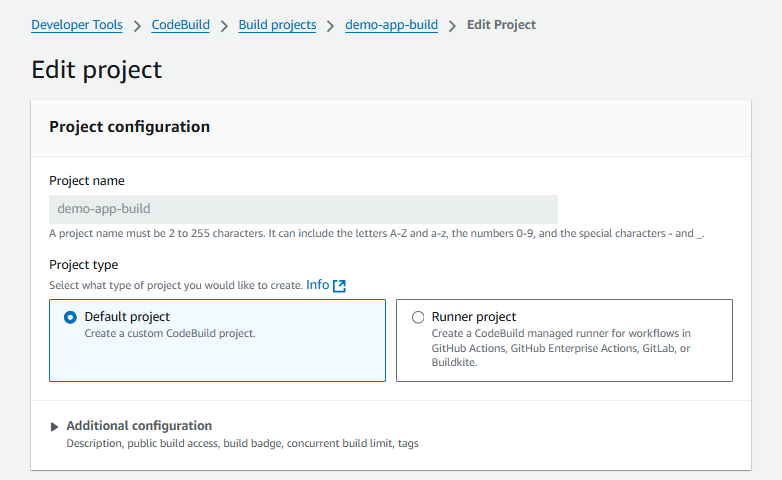

- Since code commit is no longer available for storing repos in AWS we will be integrating github with AWS

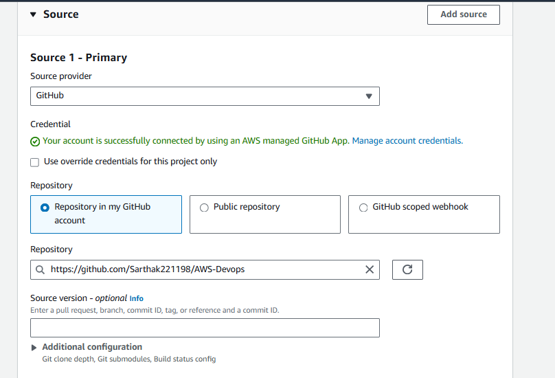

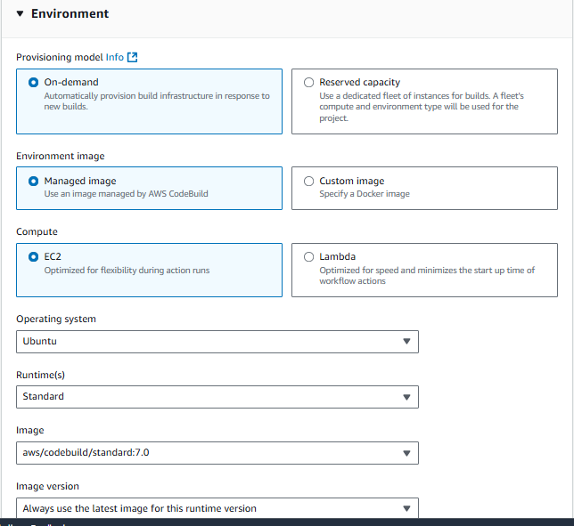

- Build spec.yml file builds the project and installs the required dependency's.

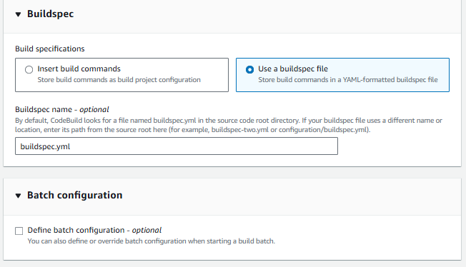

- Storing the build artifact in a S3 bucket, which can be helpfull in versioning of the code.

- Service role in AWS CodeDeploy is an IAM role that grants AWS CodeDeploy the necessary permissions to perform deployment operations on behalf of the user. The role allows CodeDeploy to interact with AWS resources like EC2 instances, Auto Scaling groups, Lambda functions, and ECS services.

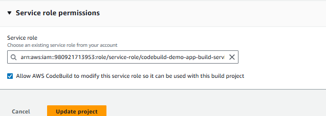

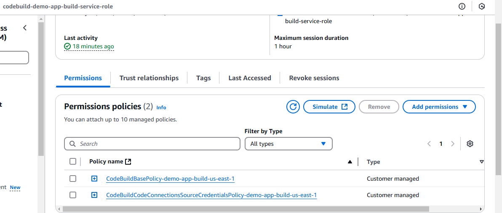

- After running the build and on its completion we can see the code being stored as a zip file in S3 bucket.

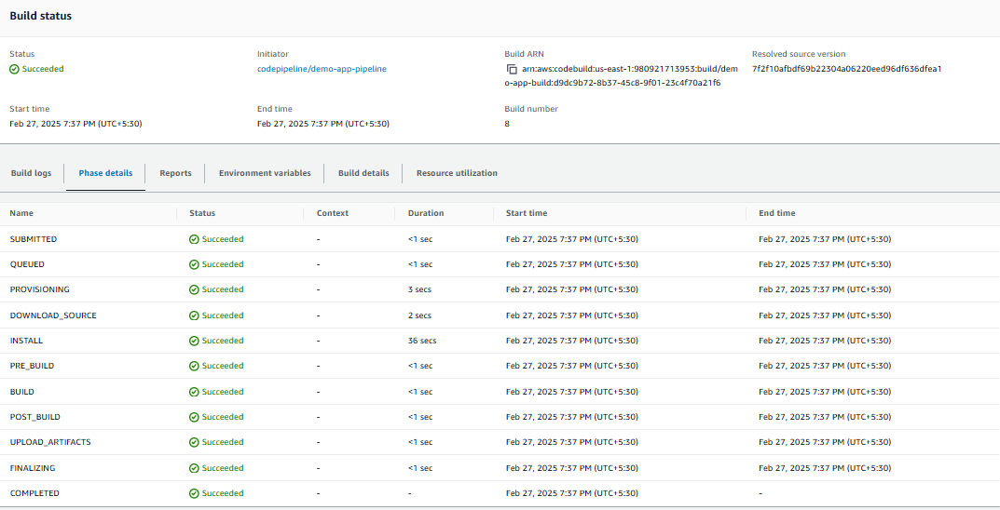

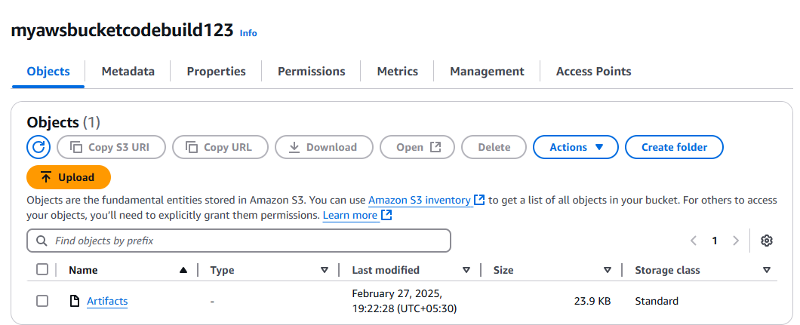

# Deployment Phase (AWS CodeDeploy)

- CodeDeploy fetches the artifact from S3.
- Deploys the application to EC2 instances, ECS, or Lambda.
- Uses deployment strategies like Blue-Green or Rolling Updates.

# Code Deploy settings

- creation of applications, deployment groups and deployments

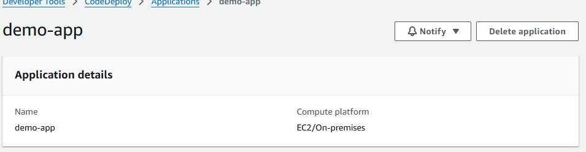

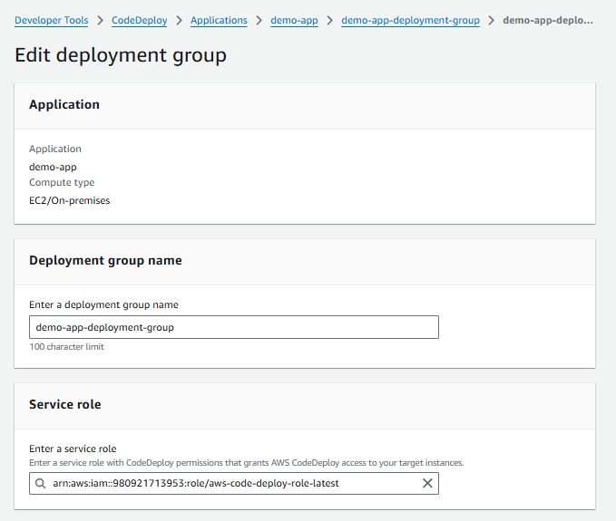

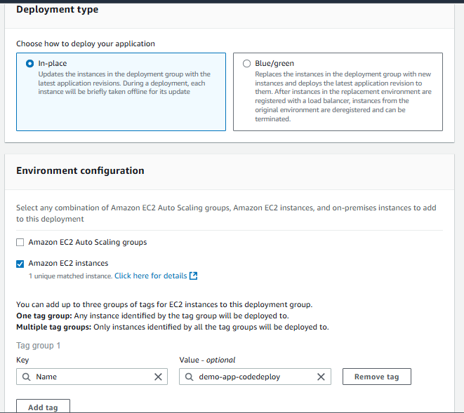

- Need to create an Ubuntu 22.04 LTS version EC2 instance with code deploy agent installed

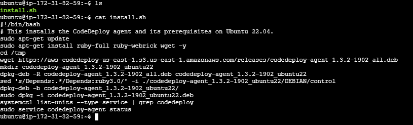

- Deployment creation

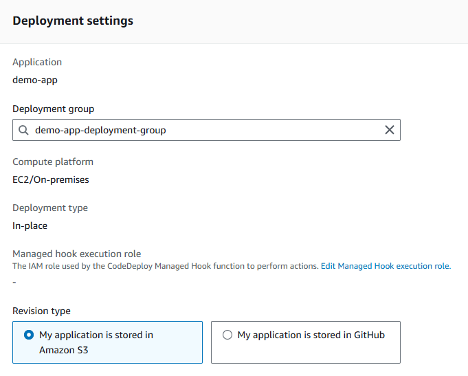

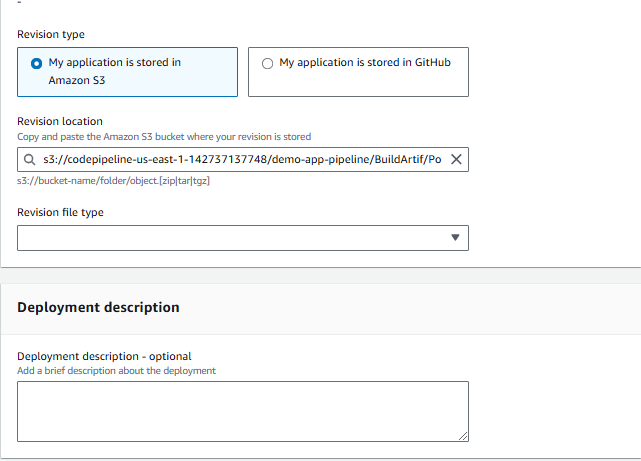

- Deployment completion and application hosted on the public IP of the EC2 instance.

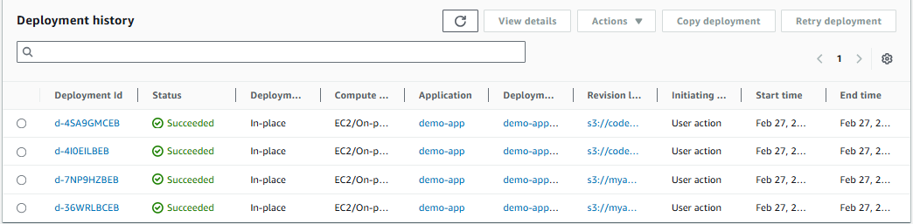

- HTML website hosted on the EC2 instances

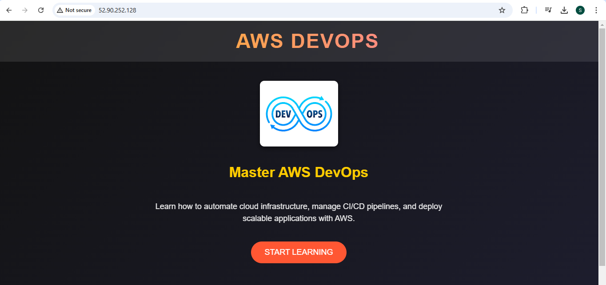

# Pipeline Execution (AWS CodePipeline)

- Automates the entire process.
- Ensures seamless deployments.

# Code pipeline settings

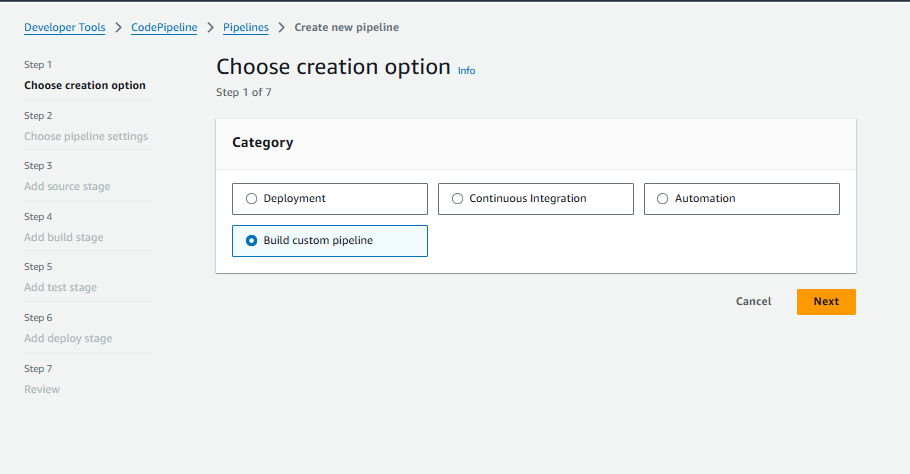

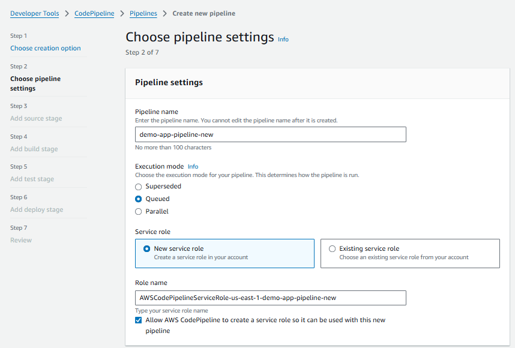

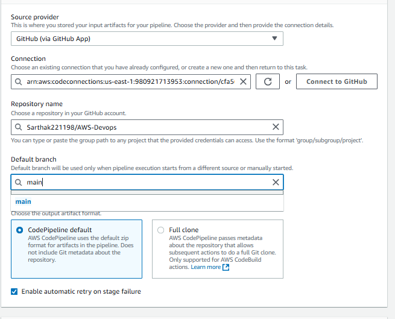

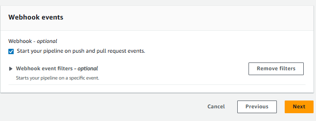

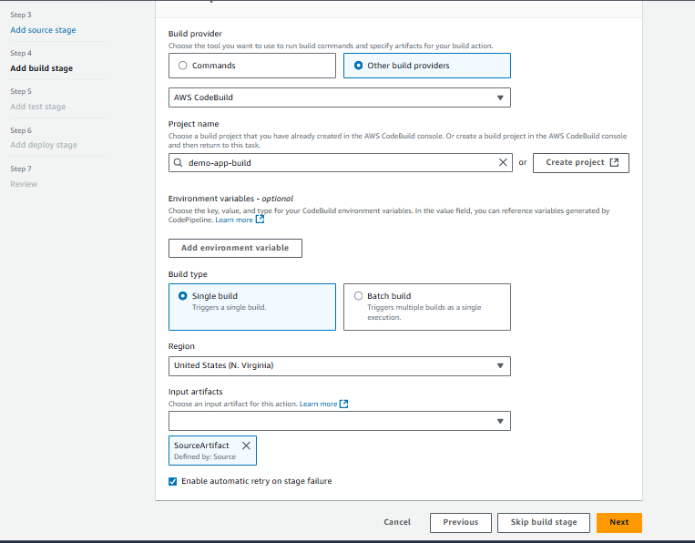

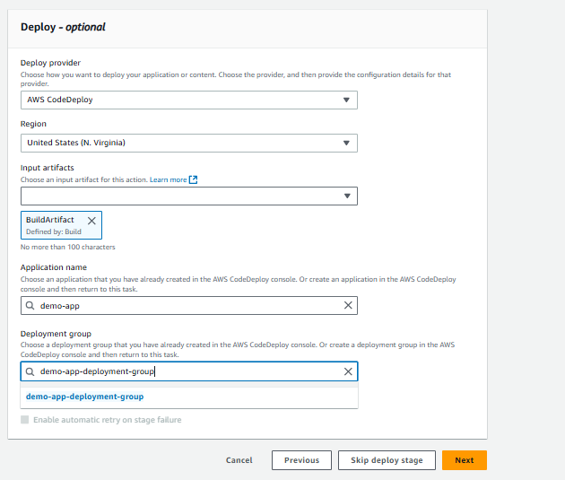

- Pipeline execution completed.

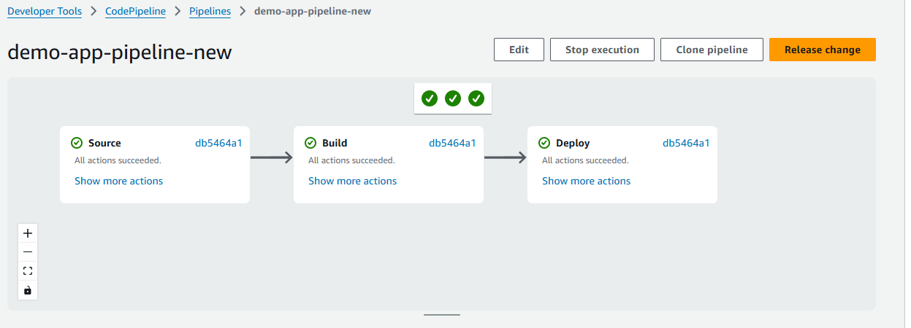

- Testing of the pipeline with changes in the index.html
- As soon as we push the new changes to the github repo the pipeline executes automatically

- New pipeline execution

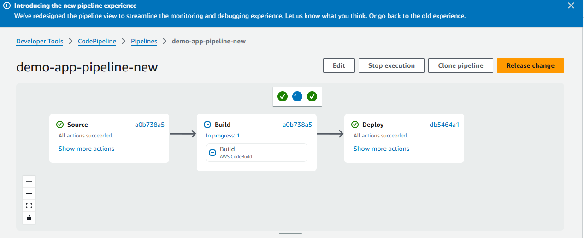

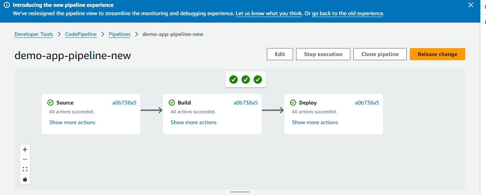

- Updated html index website with succesfull code build and code deploy on the EC2 instance

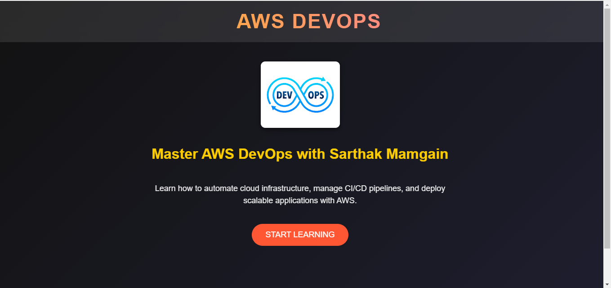

# 🛠 Technologies Used
- ✅ AWS Services: CodePipeline, CodeBuild, CodeDeploy, S3, EC2, IAM
- ✅ Version Control: GitHub
- ✅ Build Automation: CodeBuild (buildspec.yml)
- ✅ Deployment Strategy: In Line deployment

# Summary

- The project successfully implemented a CI/CD pipeline using AWS services—CodePipeline, CodeBuild, and CodeDeploy—to automate the software deployment process. This setup ensured that application updates were efficiently built, tested, and deployed with minimal manual intervention.
- The pipeline started with source code management, where the application code was stored in GitHub. CodePipeline was configured to detect changes in the repository and trigger the pipeline automatically upon new commits. This streamlined the development workflow, eliminating the need for manual deployments.
- Once a change was detected, AWS CodeBuild handled the continuous integration process. It fetched the latest code, executed build commands as defined in the buildspec.yml file, and ran unit tests to ensure the code's stability. If the build process was successful, the artifacts were packaged and stored in Amazon S3 for deployment.
- For continuous deployment, AWS CodeDeploy managed the release process to EC2 instances or ECS containers. The deployment strategy depended on the environment, with rolling deployments used for EC2 to ensure a gradual rollout, while blue-green deployments were used for ECS to achieve zero-downtime updates. The deployment lifecycle was controlled by the appspec.yml file, which defined pre- and post-deployment actions such as stopping services, extracting files, and restarting applications.
- By implementing this CI/CD pipeline, the project achieved faster and more reliable deployments, reducing manual errors and improving efficiency. The automated workflow enabled seamless application updates, high availability, and scalability, making it easier to manage deployments across different environments

