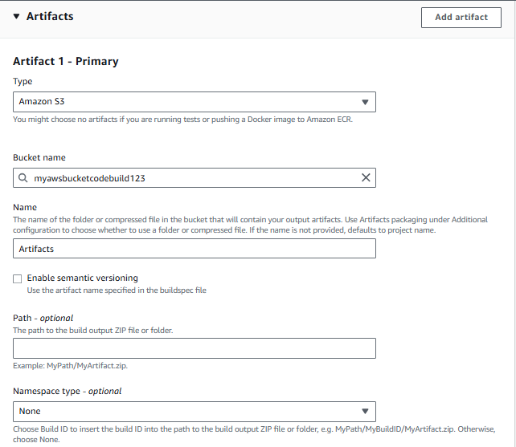
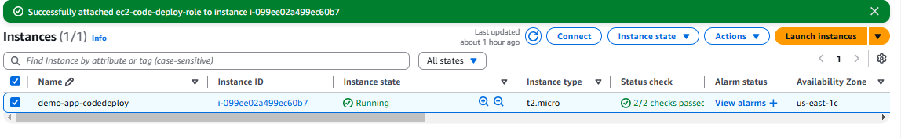

# AWS DevOps Project: CI/CD with CodeBuild, CodeDeploy, and CodePipeline

# 📌 Project Overview

This project demonstrates a fully automated CI/CD pipeline using AWS DevOps services, including:

- AWS CodeBuild → Builds the application
- AWS CodeDeploy → Deploys the application to EC2 or other environments
- AWS CodePipeline → Automates the workflow from source to deployment

🎯 Project Workflow

# Build Phase (AWS CodeBuild)

- The application source code is retrieved.
- CodeBuild runs unit tests and creates an artifact.
- The built package is stored in an S3 bucket.

# Code build settings

- Since code commit is no longer available for storing repos in AWS we will be integrating github with AWS

- Build spec.yml file builds the project and installs the required dependency's.

- Storing the build artifact in a S3 bucket, which can be helpfull in versioning of the code.

- Service role in AWS CodeDeploy is an IAM role that grants AWS CodeDeploy the necessary permissions to perform deployment operations on behalf of the user. The role allows CodeDeploy to interact with AWS resources like EC2 instances, Auto Scaling groups, Lambda functions, and ECS services.

- After running the build and on its completion we can see the code being stored as a zip file in S3 bucket.

# Deployment Phase (AWS CodeDeploy)

- CodeDeploy fetches the artifact from S3.
- Deploys the application to EC2 instances, ECS, or Lambda.
- Uses deployment strategies like Blue-Green or Rolling Updates.

# Code Deploy settings

- creation of applications, deployment groups and deployments

- Need to create an Ubuntu 22.04 LTS version EC2 instance with code deploy agent installed

- Deployment creation

- Deployment completion and application hosted on the public IP of the EC2 instance.

- HTML website hosted on the EC2 instances

# Pipeline Execution (AWS CodePipeline)

- Automates the entire process.
- Ensures seamless deployments.

# Code pipeline settings

# 🛠 Technologies Used
- ✅ AWS Services: CodePipeline, CodeBuild, CodeDeploy, S3, EC2, IAM
- ✅ Version Control: GitHub
- ✅ Build Automation: CodeBuild (buildspec.yml)
- ✅ Deployment Strategy: In Line deployment

